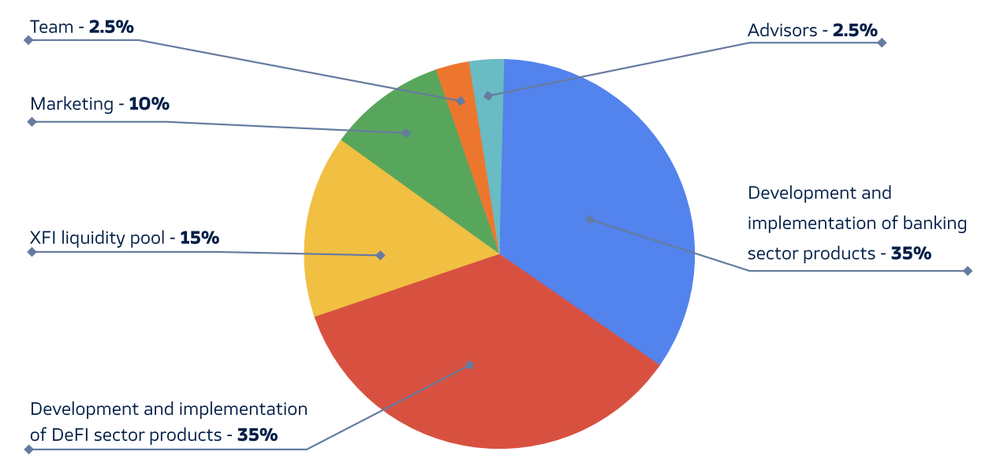

# MPX Coin

**MPX** is a unit of computing power in the CrossFi Chain required to generate new XFI coins on the network. It is also a means of paying transaction fees in the Cosmos part of the blockchain.

:::info

The strength of your vote when voting on updating the network directly depends on how many MPX coins you have in your steak.

:::

## Distribution of funds from the implementation of MPX

All funds coming from the MPX implementation have the following distribution:

The economy and development strategy of the CrossFi Chain are built in such a way that the average payback period of the MPX coin is about 2 years. However, since the XFI coin is volatile and its rate depends on the market, the payback and profitability of MPX can both decrease and increase.

## MPX emission model

:::info

The MPX coin is computing power, it does not have a specific issue.

:::

The initial issue of MPX was 4 000 000 000, which is part of the strategy for the development of the XFI coin. First of all, it was necessary for its listing on exchanges.